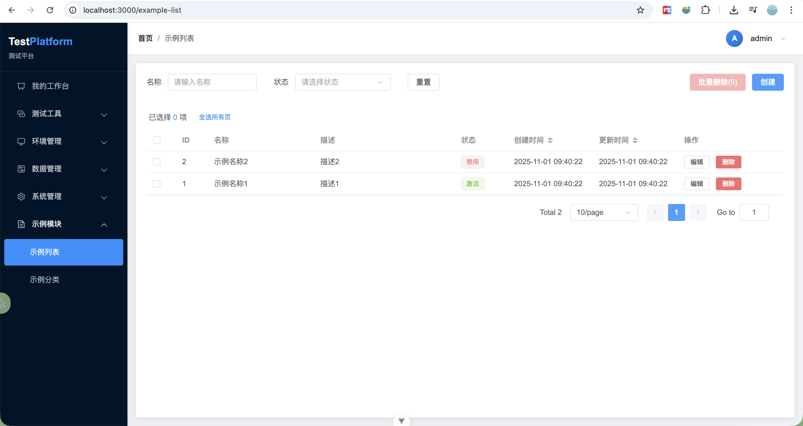
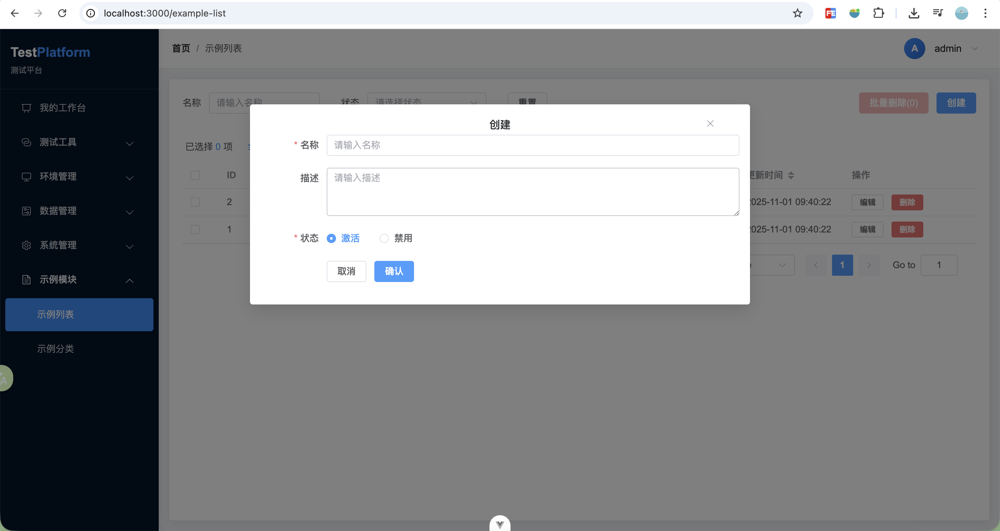

[TOC]

<h1 align="center">test_platform 服务说明文档</h1>

## 1. 后端

- 创建目录 `mkdir -vp test_platform/backend/app`
- 创建虚拟环境 `python3 -m venv .venv`
- 激活虚拟环境 `source .venv/bin/activate`
- 创建 `requirements.txt`
- 安装依赖 `pip install flask flask-sqlalchemy flask-migrate flask-cors flask-restful`
- 将依赖列表写入文件 `pip freeze > backend/requirements.txt`
- 安装依赖 `pip install -r backend/requirements.txt`
- 创建配置文件 `backend/core/config.py`
- 创建 `backend/app/__init__.py`
- 创建数据库模型 `backend/app/models/example/example_model.py`
- 创建业务层 `backend/app/services/example/example_service.py`
- 创建模块 API 路由 `backend/app/routes/example/example_routes.py`
- 创建启动脚本 `backend/main.py`
- 环境配置说明

### 环境配置

项目支持三种环境配置：**开发环境**、**测试环境**、**生产环境**

#### 环境变量配置

通过设置 `FLASK_ENV` 环境变量来选择环境：

```bash
# 开发环境（默认）
export FLASK_ENV=development

# 测试环境
export FLASK_ENV=testing

# 生产环境
export FLASK_ENV=production
```

#### 环境差异说明

| 配置项               | 开发环境        | 测试环境 | 生产环境     |
| -------------------- | --------------- | -------- | ------------ |
| DEBUG                | True            | True     | False        |
| SQLALCHEMY_ECHO      | True            | False    | False        |
| LOG_LEVEL            | DEBUG           | INFO     | WARNING      |
| REQUIRE_GLOBAL_TOKEN | false（可配置） | true     | true         |
| CORS_ORIGINS         | \*              | \*       | 需配置       |
| SECRET_KEY           | 默认值          | 默认值   | **必须设置** |
| JWT_SECRET_KEY       | 默认值          | 默认值   | **必须设置** |

#### 启动方式

```bash
# 开发环境启动
export FLASK_ENV=development
python backend/main.py
# 或
flask run --host=0.0.0.0 --port=5001

# 测试环境启动
export FLASK_ENV=testing
python backend/main.py

# 生产环境启动（使用 gunicorn）
export FLASK_ENV=production
export SECRET_KEY=your-secret-key
export JWT_SECRET_KEY=your-jwt-secret-key
cd backend && gunicorn -w 4 -b 0.0.0.0:5001 main:app
```

#### Docker 启动

```bash
# 开发环境
FLASK_ENV=development docker-compose up

# 测试环境
FLASK_ENV=testing docker-compose up

# 生产环境
FLASK_ENV=production SECRET_KEY=xxx JWT_SECRET_KEY=xxx docker-compose up
```

- 初始化数据库

```
# 指定应用工厂函数
export FLASK_APP=app.routes:create_app

# 初始化数据库
rm -rf migrations/
flask db init
flask db migrate -m "Initial migration"

# 仅更新
flask db upgrade

# 删除所有表
flask db downgrade base
```

后端命名规范

```
backend/app/models/example/example_model.py
backend/app/services/example/example_service.py
backend/app/routes/example/example_routes.py
```

## 2. 前端

- 初始化项目

```
npm init vue@latest frontend
cd frontend
npm install element-plus axios vue-router pinia
```

- 配置项目 `frontend/vue.config.js`
- 创建路由 `frontend/src/router/index.js`
- 创建 `frontend/src/services/exampleService.js`
- 创建 `frontend/src/stores/exampleStore.js`
- 创建项目组件列表 `frontend/src/views/ExampleView.vue`
- 启动项目 `npm run dev`

```text
Views/Components → Stores → Services → Backend API
       ↓              ↓          ↓
   用户交互       状态管理    网络请求
```

前端命名规范

```
frontend/src/services/exampleService.js
frontend/src/stores/exampleStore.js
frontend/src/views/ExampleView.vue
frontend/src/components/ExampleDialog.vue
frontend/src/router/index.js
layouts/AppLayout.vue
```

## 3. 测试

- 查询接口

```
查询所有
curl -X GET "http://localhost:5001/api/examples"

分页查询
curl -X GET "http://localhost:5001/api/examples?page=1&per_page=10"

获取单个 example 数据
curl -X GET "http://localhost:5001/api/examples/1"
```

- 新增接口

```
curl 'http://localhost:5001/api/examples' \
  -H 'Content-Type: application/json' \
  --data-raw '{"name":"示例名称","description":"","status":"active"}'
```

- 更新接口

```
curl -X PUT "http://localhost:5001/api/examples/1" \
-H "Content-Type: application/json" \
  --data-raw '{"name":"更新示例名称","description":"","status":"active"}'
```

- 删除接口

```
curl -X DELETE "http://localhost:5001/api/examples/1"
```

列表页面



新增 example 接口页面



## 4. 部署

Docker 部署文件  
后端：[backend/Dockerfile](backend/Dockerfile)  
前端：[frontend/Dockerfile](frontend/Dockerfile)  
汇总：[docker-compose.yml](docker-compose.yml)

封装启动脚本 [start.sh](start.sh)

```bash
# 删除服务
docker-compose stop test_platform_backend test_platform_frontend
docker-compose rm -f test_platform_backend test_platform_frontend

# 启动服务
docker-compose up --build -d test_platform_backend test_platform_frontend
```
